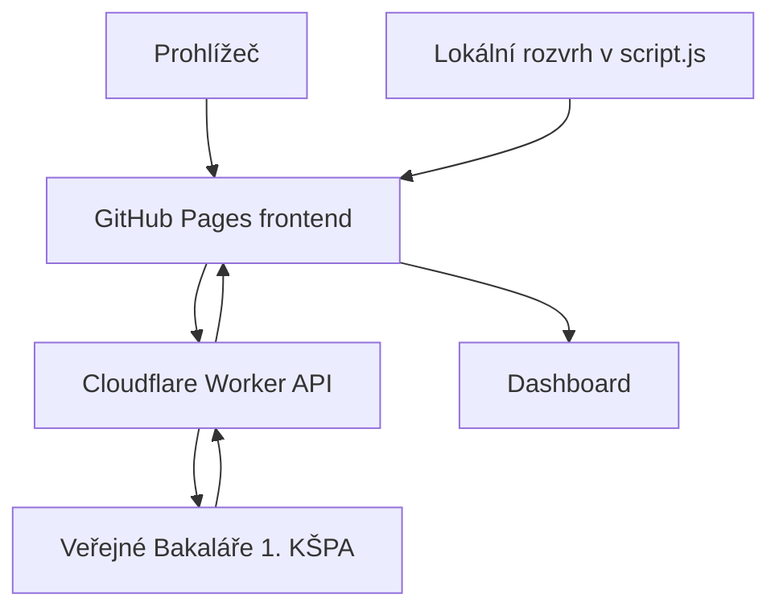

# School Progress Advanced

Osobní školní dashboard pro třídu **DE4A**. Zobrazuje průběh studia, aktuální stav dne, rozvrh z veřejných Bakalářů, změny ve výuce a stav rozvrhu učitele Jana Cafourka („Cáfa Tracker“).

Živá verze: [johnnyhotovost.github.io/School-Progress-Advanced](https://johnnyhotovost.github.io/School-Progress-Advanced/)

Aktuální verze frontendu: **1.6.5**  
Aktuální verze Worker parseru: **v9**

## Co projekt umí

- zobrazuje stálý, aktuální a příští rozvrh třídy;
- automaticky načítá data z veřejných Bakalářů přes Cloudflare Worker;
- při výpadku použije vestavěný lokální rozvrh;
- rozpoznává běžné hodiny, dělené skupiny, suplování, zrušené hodiny a mimořádné bloky;
- zobrazuje například akce školy, třídnické práce, technické důvody a volné dny;
- zvýrazňuje dnešní den, probíhající hodinu a již uplynulé hodiny;
- skládá Daily Progress podle skutečného rozvrhu aktuálního týdne;
- ukazuje pevně vyznačenou obědovou pauzu 12:20–12:50;
- sleduje aktuální rozvrh učitele UV069 v Cáfa Trackeru;
- počítá kalendářní i školní průběh týdne, měsíce, roku a celého studia;
- nabízí motivy, změnu měřítka, průhlednost karet a skrytí jednotlivých částí;
- náhodně vybírá Minecraft splash texty ze samostatného textového souboru.

## Jak je projekt postavený

Projekt má dvě oddělené části:

1. **Frontend na GitHub Pages** – soubory `index.html`, `styles.css` a `script.js`.
2. **Cloudflare Worker API** – soubor `cloudflare-worker.mjs`, který stáhne veřejnou stránku Bakalářů, rozparsuje ji a vrátí čistá JSON data.



Frontend nečte HTML Bakalářů přímo. Prohlížeč by narazil na omezení CORS a stránka by musela obsahovat složitý parser. Worker proto funguje jako bezpečná veřejná mezivrstva bez přihlašovacích údajů.

## Datový tok po otevření stránky

1. Prohlížeč načte HTML, CSS a JavaScript z GitHub Pages.
2. Dashboard okamžitě připraví lokální nouzová data, takže nezůstane prázdný.
3. JavaScript zároveň požádá Worker o:
   - stálý rozvrh třídy;
   - rozvrh třídy pro tento týden;
   - rozvrh třídy pro příští týden, pokud je právě vybraný;
   - rozvrh učitele pro tento týden.
4. Worker stáhne odpovídající veřejné stránky Bakalářů.
5. Worker z HTML vytvoří strukturovaná JSON data.
6. Frontend online data ověří a vykreslí.
7. Pokud některý požadavek selže nebo vrátí neplatná data, frontend použije nejbližší dostupný podklad podle pravidel fallbacku.
8. Online data se automaticky obnovují každých **5 minut**. Časové stavy v rozhraní se přepočítávají každých **30 sekund**.

## Soubory v repozitáři

| Soubor | Účel |
|---|---|
| `index.html` | Struktura dashboardu, nastavení, přepínače a všechny hlavní sekce. |
| `styles.css` | Celý vzhled, responzivní layout, motivy, průhlednost, animace a stavy rozvrhu. |
| `script.js` | Konfigurace, lokální data, načítání API, fallback, výpočty a vykreslování UI. |
| `cloudflare-worker.mjs` | Worker API a parser veřejných stránek Bakalářů. |
| `MinecraftTextSource.txt` | Zdroj náhodných Minecraft splash textů. |
| `Monocraft.ttf` | Font použitý pro Minecraft splash text. |
| `Halloween.png` | Pozadí motivu Halloween. |
| `Christmas.png` | Pozadí motivu Christmas. |
| `Kakajicko.png` | Pozadí motivu Kakajíčko. |
| `loona.png` | Pozadí motivu Loona. |
| `sobokill.png` | Pozadí motivu SOBOKILL. |
| `KasparnaKart.png` | Pozadí motivu KašpárnaKart™. |
| `BattleCats.png` | Pozadí motivu Battle Cats. |
| `favicon1.png` | Aktuální favicon stránky. |
| `*Backup*` | Starší ruční zálohy. Aplikace je za běhu nepoužívá. |

## Konfigurace frontendu

Hlavní konfigurace je na začátku `script.js`:

```js
const CONFIG = Object.freeze({
  workerBase: "https://bakalariapi.janpilat-bp.workers.dev",
  classId: "5A",
  className: "DE4A",
  teacherId: "UV069",
  version: "1.6.5",
  refreshMs: 5 * 60 * 1000,
  requestTimeoutMs: 12000
});
```

### Význam hodnot

| Hodnota | Co znamená |
|---|---|
| `workerBase` | Veřejná adresa nasazeného Cloudflare Workeru bez lomítka na konci. |
| `classId` | Interní ID třídy ve veřejné URL Bakalářů. Pro DE4A je aktuálně `5A`. |
| `className` | Název zobrazovaný v dashboardu. Nemusí být stejný jako `classId`. |
| `teacherId` | Interní ID učitele ve veřejné URL Bakalářů. Cáfa používá `UV069`. |
| `version` | Verze frontendu zobrazená v patičce. |
| `refreshMs` | Interval automatického načítání online dat v milisekundách. |
| `requestTimeoutMs` | Maximální doba jednoho požadavku z prohlížeče na Worker. |

### Důležitý rozdíl mezi `classId` a `className`

Bakaláři používají v URL identifikátor `5A`, ale v jejich rozhraní i na dashboardu se třída zobrazuje jako DE4A. Proto se nesmí automaticky změnit obě hodnoty na stejný text.

Aktuální veřejný zdroj třídy:

```text
https://1kspa-kladno.bakalari.cz/Timetable/Public/Actual/Class/5A
```

Aktuální veřejný zdroj učitele:

```text
https://1kspa-kladno.bakalari.cz/Timetable/Public/Actual/Teacher/UV069
```

## Režimy rozvrhu

Přepínač je přímo nad rozvrhem. Poslední zvolený režim se ukládá do prohlížeče.

| Režim | Parametr API | Zdroj Bakalářů | Co obsahuje |
|---|---|---|---|
| Stálý | `Permanent` | `/Timetable/Public/Permanent/Class/5A` | Základní dlouhodobý rozvrh bez týdenních změn. |
| Tento týden | `Actual` | `/Timetable/Public/Actual/Class/5A` | Reálný aktuální týden včetně změn a mimořádných událostí. |
| Příští týden | `Next` | `/Timetable/Public/Next/Class/5A` | Rozvrh a známé změny pro následující týden. |

Přepnutí mění pouze velký týdenní přehled. **Daily Progress a panel Události a změny vždy používají režim Tento týden**, protože mají popisovat právě probíhající týden, nikoli stálou šablonu nebo příští týden.

### Zvýraznění v rozvrhu

- žlutý rámeček označuje dnešní den;
- ztlumené buňky s fajfkou jsou již ukončené hodiny;
- aktivní hodina má vlastní zvýraznění;
- akce, zrušené hodiny a suplování mají odlišné vizuální stavy;
- blok přes více hodin se vykreslí jako souvislá překryvná karta;
- detail buňky je dostupný myší, kliknutím i z klávesnice.

U režimu Příští týden se hodiny neoznačují jako uplynulé. U stálého a aktuálního přehledu se minulost posuzuje podle dne a konce konkrétní hodiny.

## Online data a lokální nouzový režim

Lokální data jsou uložená přímo v `script.js`:

- `LOCAL_CLASS_DAYS` – nouzový stálý rozvrh DE4A;
- `LOCAL_TEACHER_DAYS` – nouzový rozvrh pro Cáfa Tracker.

Lokální třídní rozvrh je snapshot veřejných Bakalářů ze dne **3. 9. 2026**. Je to nouzová základna, ne zdroj aktuálních změn.

### Přesné pořadí fallbacku

#### Stálý rozvrh

1. online `Permanent` z Bakalářů;
2. vestavěný `LOCAL_CLASS_DAYS`.

#### Tento týden

1. online `Actual` z Bakalářů;
2. online stálý rozvrh;
3. vestavěný `LOCAL_CLASS_DAYS`.

#### Příští týden

1. online `Next` z Bakalářů;
2. online stálý rozvrh;
3. vestavěný `LOCAL_CLASS_DAYS`.

#### Cáfa Tracker

1. online učitelský rozvrh `Actual`;
2. vestavěný `LOCAL_TEACHER_DAYS`.

Lokální režim neumí znát nové suplování, zrušené hodiny ani právě přidané školní akce. Jeho účelem je zachovat použitelný základ při výpadku Bakalářů, Workeru nebo internetu.

## Události a změny

Panel pracuje pouze s daty režimu Tento týden. Zobrazuje:

- školní akce;
- suplování;
- odpadlé hodiny;
- mimořádné bloky přes více vyučovacích hodin;
- volné dny a další události, které Bakaláři vloží do rozvrhu.

Worker rozpoznává běžné atomy rozvrhu i speciální záznamy Bakalářů:

- `PauseGuards`, `HourGuards` a `GeneralGuards`;
- absence a jejich druh;
- celodenní `DayOff`;
- změny, odstraněné hodiny a poznámky u jednotlivých atomů.

Díky tomu nejsou technické důvody, akce školy nebo třídnické práce omezené na klasickou 45minutovou buňku. Pokud Bakaláři uvedou začátek a konec, Worker vypočítá všechny překryté hodiny a frontend vytvoří jeden souvislý blok.

## Daily Progress

Daily Progress se vždy skládá z aktuálního rozvrhu tohoto týdne.

Postup výpočtu:

1. vybere se dnešní pracovní den;
2. načtou se dnešní hodiny z `actualDays`;
3. zrušená hodina se odstraní;
4. mimořádná událost se použije místo běžné hodiny;
5. určí se první a poslední aktivní hodina;
6. podle aktuálního času se zobrazí stav Před výukou, Probíhá, Pauza, Oběd nebo konec výuky;
7. v časové ose se označí ukončené, aktuální a budoucí bloky.

Obědová pauza je pevně nastavená na **12:20–12:50**. Časová osa zachovává skutečné poměry délek hodin a přestávek. Aktuální poloha během dne je označena samostatným markerem.

O víkendu, během zadaných prázdnin nebo ve dni bez aktivních hodin se zobrazí stav bez výuky.

## Cáfa Tracker

Cáfa Tracker používá pouze aktuální učitelský rozvrh:

```text
/api/timetable?teacher=UV069&type=Actual
```

Worker záměrně odmítne `Permanent` a `Next` pro učitele. Tracker má ukazovat skutečnou aktuální hodinu, včetně změn tohoto týdne.

Frontend podporuje prvních **9 vyučovacích hodin učitele**, tedy do 16:05. Podle času zobrazí například:

- výuka ještě nezačala;
- aktuální třídu, předmět a místnost;
- pauzu a následující hodinu;
- dnešní výuka skončila;
- dnes bez naplánované výuky.

Text zůstává lehce humorný, ale samotný stav je založený na rozvrhu, ne na náhodném odhadu.

## Real-Time a Raw-Time

### Real-Time

Počítá běžně plynoucí kalendářní čas. Do výpočtu měsíce, školního roku a celého studia vstupují všechny kalendářní dny.

### Raw-Time

Počítá pouze školní dny. Vynechává:

- soboty a neděle;
- intervaly uvedené v `NON_SCHOOL_RANGES`;
- jednotlivé dny uvedené v `DIRECTOR_DAYS`.

V aktuální implementaci používají týdenní Real-Time a Raw-Time stejný průběh pracovního týdne od pondělí do pátku. Rozdíl se projeví hlavně u měsíce, školního roku, celého studia a počtu školních dní do maturity.

### Pevné časové body

```js
const HIGH_SCHOOL_START = localDate(2023, 9, 4);
const HIGH_SCHOOL_END = localDateEnd(2027, 6, 30);
const MATURITA_APPROX = localDateEnd(2027, 5, 1);
```

Datum maturity je záměrně přibližné. Pokud bude známý přesný termín, upraví se `MATURITA_APPROX`.

### Prázdniny a ředitelské volno

Prázdniny a další neškolní intervaly jsou ručně zadané v `NON_SCHOOL_RANGES`. Samostatné ředitelské dny patří do `DIRECTOR_DAYS` ve formátu `YYYY-MM-DD`:

```js
const DIRECTOR_DAYS = ["2026-11-20"];
```

Tyto seznamy ovlivňují Raw-Time i rozhodnutí, zda má Daily Progress daný den považovat za školní.

## Minecraft splash text

Při každém načtení stránky se stáhne `MinecraftTextSource.txt` s vypnutou cache. JavaScript:

1. rozdělí soubor po řádcích;
2. odstraní prázdné řádky;
3. ignoruje řádky začínající `#`;
4. náhodně vybere jeden zbývající text;
5. při chybě souboru použije vestavěný fallback seznam.

Nový text tedy stačí přidat jako samostatný řádek:

```text
Tady bude nový splash text
```

Barvu a stín textu řídí aktuální motiv. Pulzování zajišťuje CSS animace `splash-pulse`.

## Motivy a pozadí

Aktuálně jsou dostupné tyto motivy:

| Motiv | Typ pozadí |
|---|---|
| Light | Čistý světlý vzhled bez obrázku. |
| Dark | Výchozí tmavý vzhled bez obrázku. |
| Loona | `loona.png` |
| SOBOKILL | `sobokill.png` |
| KašpárnaKart™ | `KasparnaKart.png` |
| Battle Cats | `BattleCats.png` |
| Halloween | `Halloween.png` |
| Christmas | `Christmas.png` |
| Easter | Pastelové CSS gradienty. |
| Kakajíčko | `Kakajicko.png` |
| Maturita | Tmavý formální CSS grid a gradienty. |

Každý motiv je definovaný jako `body.theme-...` v `styles.css`. Definice obsahuje barvy textu, povrchů, okrajů, akcentů a případně obrázek pozadí.

U obrázkových motivů jsou důležité hlavně tyto proměnné:

```css
--theme-image: url("./Nazev.png");
--theme-opacity: 0.20;
--theme-position: center top;
--theme-size: cover;
--theme-filter: saturate(0.92) contrast(1.05);
```

`--theme-opacity` nastavuje intenzitu obrázku pozadí. Není to průhlednost karet v nastavení.

### Jak přidat nový motiv

1. Přidej položku do `#themeSelect` v `index.html`.
2. Přidej její interní název do pole `THEMES` v `script.js`.
3. V `styles.css` vytvoř `body.theme-interninazev` se všemi potřebnými proměnnými.
4. Pokud motiv používá obrázek, nahraj ho do kořene repozitáře a odkaž se na přesný název včetně velikosti písmen.
5. Zkontroluj kontrast běžného, tlumeného i akcentního textu.
6. Zvyš verzi frontendu a query stringy CSS/JS, aby prohlížeč nepoužil starou cache.

## Nastavení dashboardu

Nastavení se ukládá pouze do `localStorage` daného prohlížeče. Neodesílá se na server a mezi zařízeními se nesynchronizuje.

| Nastavení | Rozsah / možnosti | Klíč v `localStorage` |
|---|---|---|
| Motiv | 11 motivů | `sp_theme` |
| Režim nadpisu | Normal, Nonchalant, Freaky | `sp_mode` |
| Velikost rozhraní | 85–120 % | `sp_ui_scale` |
| Průhlednost karet | 0–100 % | `sp_card_transparency` |
| Denní progres | zapnuto/vypnuto | `sp_toggle_daily` |
| Události | zapnuto/vypnuto | `sp_toggle_events` |
| Cáfa Tracker | zapnuto/vypnuto | `sp_toggle_tracker` |
| Rozvrh | zapnuto/vypnuto | `sp_toggle_tt` |
| Režim rozvrhu | Permanent, Actual, Next | `sp_timetable_view` |

Výchozí průhlednost karet je **60 %**. To znamená, že samotný barevný povrch karty má opacitu 40 %. Hodnota 100 % vytvoří plně průhledné karty, jejich okraje a obsah však zůstanou viditelné.

Smazání dat webu nebo `localStorage` vrátí všechna nastavení na výchozí hodnoty.

## Cloudflare Worker API

Aktuální Worker běží na:

```text
https://bakalariapi.janpilat-bp.workers.dev
```

### Endpointy

```text
GET /
GET /api/timetable?class=5A&type=Permanent
GET /api/timetable?class=5A&type=Actual
GET /api/timetable?class=5A&type=Next
GET /api/timetable?teacher=UV069&type=Actual
OPTIONS /*
```

Povolené hodnoty `type` jsou `Permanent`, `Actual` a `Next`. Velikost písmen nehraje roli. Požadavek musí obsahovat právě jeden parametr `class` nebo `teacher`.

U učitele je povolen pouze `type=Actual`. Neplatné ID, kombinace parametrů nebo metoda vrátí JSON chybu se stavem 400 nebo 405.

### Zjednodušený formát odpovědi

```json
{
  "ok": true,
  "source": {
    "mode": "class",
    "url": "https://1kspa-kladno.bakalari.cz/...",
    "upstreamStatus": 200,
    "type": "Actual",
    "classId": "5A"
  },
  "generatedAt": "2026-09-04T12:00:00.000Z",
  "times": [
    { "start": "7:55", "end": "8:40" }
  ],
  "days": {
    "Mon": [],
    "Tue": [],
    "Wed": [],
    "Thu": [],
    "Fri": []
  },
  "marks": [],
  "events": [],
  "blocks": [],
  "parser": {
    "version": "v9-embedded-timetableData",
    "format": "embedded-timetableData",
    "mode": "class",
    "warnings": [],
    "stats": {}
  }
}
```

Význam hlavních polí:

| Pole | Význam |
|---|---|
| `times` | Časy jednotlivých vyučovacích hodin. |
| `days` | Hodiny pro pondělí až pátek. |
| `marks` | Změny jedné buňky: událost, suplování nebo zrušení. |
| `events` | Položky pro panel Události a změny. |
| `blocks` | Mimořádné události přes jednu nebo více hodin. |
| `parser` | Diagnostika použitého parseru a počty zpracovaných záznamů. |

### Jak Worker parsuje Bakaláře

Primární parser hledá v HTML JavaScriptový objekt `timetableData`. Z něj zpracuje:

- seznam hodin;
- jednotlivé dny a atomy rozvrhu;
- předmět, místnost, učitele a skupinu;
- změny, odstranění a poznámky;
- guards, absence a volné dny.

Pokud `timetableData` chybí nebo není validní JSON, Worker použije starší fallback parser založený na atributech `data-detail`.

Worker má limit **12 sekund** pro stažení Bakalářů. Pokud upstream selže nebo parser nenajde použitelná data, vrátí stav 502. Frontend potom přejde do nouzového režimu.

### Cache Workeru

| Režim | Browser `max-age` | Sdílená cache `s-maxage` |
|---|---:|---:|
| Permanent | 300 s | 600 s |
| Actual | 30 s | 60 s |
| Next | 30 s | 60 s |

Worker povoluje CORS pro všechny origins, protože dashboard je veřejná statická stránka a API pracuje pouze s veřejnými rozvrhy.

## Lokální spuštění

Stránku je vhodné spouštět přes jednoduchý HTTP server. Neotvírej pouze `index.html` přes `file://`, protože načítání `MinecraftTextSource.txt` a další požadavky se mohou v různých prohlížečích chovat odlišně.

### Python

```bash
python -m http.server 8080
```

Potom otevři:

```text
http://localhost:8080/
```

Alternativou je rozšíření Live Server ve VS Code.

Frontend nemá build krok ani externí JavaScriptové závislosti. Stačí statický server a moderní prohlížeč.

## Kontrola před nasazením

Minimální technická kontrola:

```bash
node --check script.js
node --check cloudflare-worker.mjs
git diff --check
```

Dále ručně zkontroluj:

- že všechny obrázky uvedené v CSS skutečně existují;
- že názvy motivů souhlasí mezi HTML, JavaScriptem a CSS;
- že `classId`, `className` a `teacherId` odpovídají Bakalářům;
- že Worker vrací `ok: true` pro všechny čtyři používané endpointy;
- že se rozvrh přepne mezi Stálý, Tento týden a Příští týden;
- že lokální režim nevytvoří prázdnou stránku;
- že je text čitelný při průhlednosti karet 0 % i 100 %;
- že se změna chová rozumně na mobilu i desktopu.

## Nasazení frontendu

Frontend je statický a GitHub Pages ho publikuje z tohoto repozitáře. Běžný postup:

1. vytvořit samostatnou větev;
2. provést změny a validaci;
3. vytvořit pull request do `main`;
4. pull request sloučit;
5. počkat, než GitHub Pages zveřejní nový commit;
6. otevřít živou stránku s hard refresh nebo cache-busting parametrem.

Při změně CSS nebo JavaScriptu zvyš všechny tři hodnoty verze:

1. `CONFIG.version` v `script.js`;
2. `?v=...` u `styles.css` a `script.js` v `index.html`;
3. verzi v patičce `index.html`.

Tím se zabrání tomu, aby prohlížeč dál používal staré soubory z cache.

## Nasazení Workeru

`cloudflare-worker.mjs` je samostatná aplikace. Sloučení změny do GitHub Pages samo o sobě Worker neaktualizuje.

Repozitář aktuálně neobsahuje Wrangler konfiguraci ani automatický deploy Workeru. Při změně parseru je proto nutné aktualizovat kód existujícího Workeru `bakalariapi` v Cloudflare a samostatně ho nasadit.

Po nasazení ověř:

```text
https://bakalariapi.janpilat-bp.workers.dev/
https://bakalariapi.janpilat-bp.workers.dev/api/timetable?class=5A&type=Permanent
https://bakalariapi.janpilat-bp.workers.dev/api/timetable?class=5A&type=Actual
https://bakalariapi.janpilat-bp.workers.dev/api/timetable?class=5A&type=Next
https://bakalariapi.janpilat-bp.workers.dev/api/timetable?teacher=UV069&type=Actual
```

Kořenový endpoint musí uvádět očekávanou verzi Workeru. Ostatní endpointy musí vracet HTTP 200, `ok: true` a neprázdný objekt `days`.

## Jak změnit třídu nebo školní rok

Pouhá změna názvu v HTML nestačí. Je potřeba projít všechny datové zdroje.

1. V Bakalářích zjisti skutečné ID nové třídy z veřejné URL.
2. V `CONFIG` změň `classId` a zobrazovaný `className`.
3. Ověř všechny tři veřejné režimy rozvrhu.
4. Aktualizuj `LOCAL_CLASS_DAYS` podle nového stálého rozvrhu.
5. Pokud se změnily časy hodin, uprav `CLASS_TIMES`.
6. Uprav `HIGH_SCHOOL_END`, `MATURITA_APPROX` a seznam `NON_SCHOOL_RANGES`.
7. Pokud se mění sledovaný učitel, změň `teacherId` a `LOCAL_TEACHER_DAYS`.
8. Zkontroluj informační endpointy v `cloudflare-worker.mjs`; jsou určené jako dokumentace aktuální konfigurace.
9. Zvyš verzi frontendu, proveď kontrolu a nasazení.

## Řešení problémů

### Stránka píše „Lokální Nouzový Režim“

Nejpravděpodobnější příčiny:

1. Worker není dostupný;
2. Bakaláři neodpověděli do 12 sekund;
3. Bakaláři změnili HTML a parser data nenašel;
4. endpoint vrací chybu nebo neplatný JSON;
5. zařízení je offline.

Nejdřív otevři přímo odpovídající API endpoint. Pokud nevrací `ok: true`, problém není ve vykreslení frontendu.

### Tento nebo příští týden není dostupný, ale stálý ano

Frontend úmyslně zobrazí stálý online rozvrh jako nouzový podklad. Stav v nastavení vysvětlí, že vybraný režim není dostupný.

### Panel událostí je prázdný

- Pokud je zdroj online, pravděpodobně pro tento týden nejsou žádné rozpoznané změny.
- Pokud je dashboard v nouzovém režimu, lokální stálý rozvrh nemá aktuální události.
- Pokud jsou události vidět přímo v Bakalářích, ale API je nevrací, zkontroluj pole `parser`, `marks`, `events` a `blocks` v JSON odpovědi.

### Obrázek motivu není vidět

1. Ověř přesný název souboru včetně velkých písmen.
2. Ověř cestu v `--theme-image`.
3. Zkontroluj, zda `--theme-opacity` není `0`.
4. Proveď hard refresh.
5. Zkontroluj, zda HTML načítá aktuální verzi `styles.css?v=...`.

Průhlednost karet a intenzita obrázku jsou dvě rozdílná nastavení. Karty mohou být neprůhledné, i když se obrázek načetl správně.

### Zobrazuje se starý vzhled nebo starý JavaScript

Zvyš verzi v HTML i JavaScriptu a proveď hard refresh. GitHub Pages a prohlížeč mohou krátce držet starou cache.

### Worker vrací 502

Zkontroluj:

- `detail` a `upstreamStatus` v odpovědi;
- zda veřejná stránka Bakalářů funguje;
- zda HTML stále obsahuje `timetableData` nebo `data-detail`;
- diagnostiku `parser.warnings` a `parser.stats`.

## Známá omezení

- Parser závisí na veřejné HTML struktuře Bakalářů. Její změna může vyžadovat úpravu Workeru.
- Lokální rozvrh je ruční snapshot a časem zastará.
- Lokální nouzový režim neobsahuje živé změny.
- Prázdniny a ředitelské volno se aktualizují ručně.
- Frontend zobrazuje 7 třídních a 9 učitelských hodin, i když Bakaláři mohou vrátit delší den.
- Datum maturity je pouze orientační, dokud není známý přesný termín.
- Nastavení se ukládá jen na konkrétním zařízení a v konkrétním prohlížeči.
- Projekt zatím nemá automatickou sadu unit nebo end-to-end testů.
- Worker se nenasazuje automaticky společně s frontendem.

## Bezpečnost a soukromí

- Projekt používá pouze veřejné rozvrhy Bakalářů.
- Neobsahuje přihlašovací údaje do Bakalářů.
- Worker nepoužívá studentské účty ani neveřejné API.
- Uživatelská nastavení zůstávají v `localStorage` prohlížeče.
- API je veřejné a má CORS `*`; neměly by se do něj přidávat neveřejné údaje nebo tajné tokeny.

## Shrnutí pro běžné používání

- Zelený online stav znamená, že příslušná data přišla z Bakalářů přes Worker.
- Lokální nouzový stav znamená, že stránka použila vestavěný snapshot.
- Přepínač rozvrhu mění pouze velký týdenní přehled.
- Daily Progress a Události vždy používají tento týden.
- Cáfa Tracker vždy používá tento týden učitele UV069.
- Nastavení vzhledu se ukládá lokálně a po obnovení stránky zůstane zachované.
- Pokud něco vypadá zastarale, první kontrola je zdrojový stav a poté verze cache.

